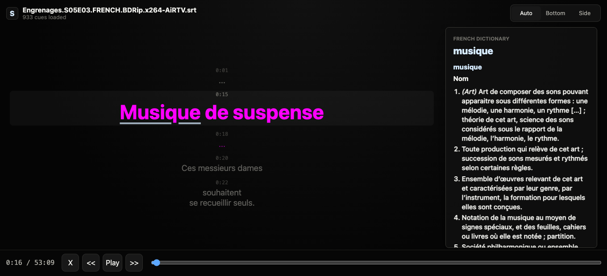

# Subtitle Def

A static React subtitle player for studying French `.srt` subtitles. It is meant to sit under or beside a video, show the current subtitle with nearby context, and let you hover or click French words for local French dictionary definitions.



## Use

Open `index.html` directly in a browser, or serve it as a static file with nginx. Internet access is required for the CDN-loaded React, Babel, and decompression libraries; subtitle parsing and dictionary lookup run in the browser.

Click **Drop or select .srt file**, or drag an `.srt` file onto the load area. Playback, seeking, display modes, and dictionary lookup all run client-side.

Use the left and right arrow keys to jump to the previous or next subtitle.

The last loaded subtitle file, position, and display mode are saved in browser local storage so refreshes can resume where you left off.

Dictionary definitions use a local Reader Dict French-French dictionary at `assets/dictionary/fr-fr-v1.js`. That generated file is intentionally not committed. Download the French Reader Dict source file, [`dict-fr-fr-noetym.df.bz2`](https://www.reader-dict.com/file/fr/dict-fr-fr-noetym.df.bz2), and run the build command below to create the local `fr-fr-v1.js` asset. The first lookup lazy-loads that external asset, caches the compressed dictionary bytes in IndexedDB, and reuses the cache on later visits. Words in subtitles are buttons, not remote links, and the selected definition stays visible in the side panel until another word is selected. If the automatic load is blocked, use the dictionary panel's import button to select `fr-fr-v1.js` once.

## Rebuild Dictionary

Regenerate the external dictionary from Reader Dict:

```sh
node scripts/build-dictionary.mjs
```

The script downloads the French source dictionary to `/tmp` if needed, builds a lookup index from headwords and aliases, compresses it, and writes it to `assets/dictionary/fr-fr-v1.js`. The generated file is a JavaScript wrapper around gzip-compressed dictionary data so it can load from a directly opened `index.html` without a local server.

## SRT Support

SRT files are cue blocks separated by blank lines:

```srt
1
00:00:01,000 --> 00:00:03,500
Bonjour tout le monde.
```

The player uses a small local SRT parser and adapts parsed cues into an internal model. It handles common SRT variants such as CRLF/LF endings, BOMs, multi-line text, missing final blank lines, optional cue indices, dot milliseconds, timing settings, overlapping cues, and out-of-order cues.
